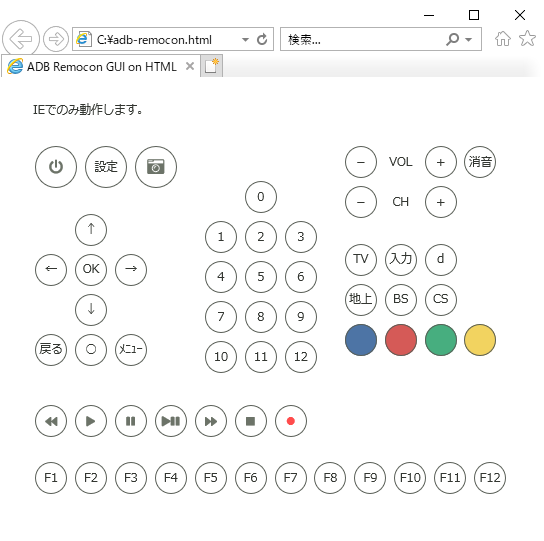

ADB-Remocon-GUI
====

ボタンを選択したら以下のadbキーコマンドを実行するだけのローカルHTML。
```sh
adb shell input keyevent KEYCODE_XXX
```
　　

||
|:-:|

Q & A
----------
Q. 実行したいキーのボタンがありません<br>
A. HTMLを改造してください

Q. デバイスを複数接続しているのですが<br>
A. HTMLを改造してください

Q. Chromeで動作しないのですが<br>
A. IEでのみ動作します
